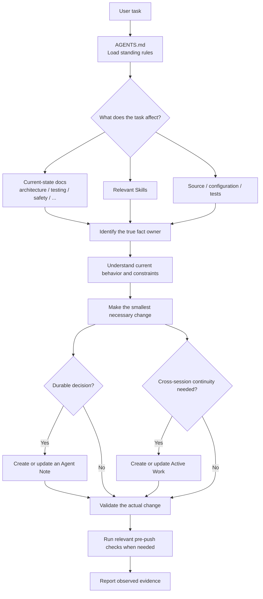
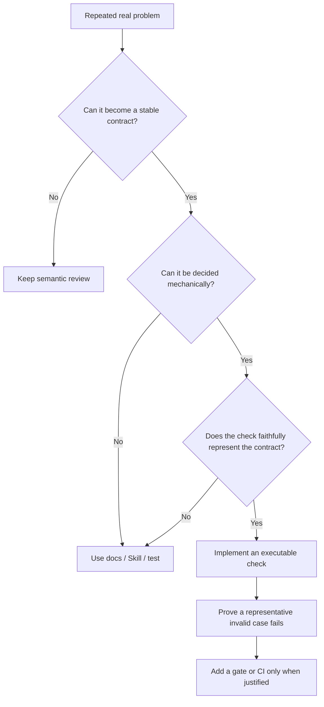

[中文](README.zh-CN.md)

# Agent Trellis

> A minimal, evidence-driven development system for coding agents, distilled from the engineering practices behind DeepSeek Harness.

Agent Trellis is a repository-local governance model for coding-agent development. Its current initializer targets Codex. It does not try to make an agent write more code; it addresses a more basic problem:

> When a project grows across files, components, repositories, and sessions, how does an agent keep knowing what is true, why the system was designed this way, where work stopped, and what evidence is required—without deriving everything again?

Agent Trellis extracts a small, product-independent structure from the development approach behind DeepSeek Harness. It deliberately avoids preinstalling a comprehensive CI system, gates, experiment infrastructure, document budgets, or a lifecycle for every possible object.

The goal is simple:

> Establish the smallest stable working structure for agents, then let governance grow from real development needs.

## Why this exists

A coding-agent task often looks like this:

```text
read code
→ understand the problem
→ make a plan
→ change the code
→ test
→ end the session
```

But much of the information that matters is not naturally recoverable from code:

- Why must this interface keep its current shape?
- Which document truly owns a fact?
- Why can a seemingly redundant wrapper not be removed yet?
- Where did a multi-session task stop?
- Which test actually proves the claimed behavior?
- Which conventions are verified, and which are guesses?
- Why was an apparently reasonable design rejected?
- Does a problem found in an earlier review still exist?

When this information lives only in chat history or temporary reasoning, the next session must reconstruct it. Agents can also create the appearance of completeness by adding structure whenever something seems absent:

```text
missing owner       → create another owner
missing lifecycle   → create another state machine
found a defect      → create another tracker
noticed a concept   → create another manifest
missing automation  → create another gate
```

Eventually the governance system becomes more complicated than the project.

Agent Trellis establishes a different operating model:

> Important facts have stable owners, durable decisions have durable records, temporary work can be resumed, reusable methods live in Skills, and mechanisms without a current responsibility are allowed not to exist.

## Core model

The system separates information by responsibility:

| Information | Owner |
| --- | --- |
| Current implemented behavior | Source, configuration, and current-state documentation |
| Cross-component architecture | `docs/architecture.md` and other explicit current-state owners |
| Durable design decisions and reasons | `.agents/notes/` |
| Temporary cross-session task state | `.agents/work/` |
| How an agent performs a recurring kind of work | `.agents/skills/` |
| Standing rules and routing | `AGENTS.md` |

The central rule is:

> **One fact, one owner.**

Other files may link to that owner, but they should not maintain writable copies that can drift.

## How the system operates



There is no special agent-memory database. Durable context comes from:

```text
source
+ current-state docs
+ Agent Notes
+ Active Work
+ Skills
```

An agent re-enters the project by rebuilding context from these repository-owned sources.

## The generated workspace

A typical initialized repository starts with this shape:

```text
.
├── AGENTS.md
├── docs/
│   ├── AGENTS.md
│   ├── architecture.md
│   ├── development.md
│   └── testing.md
└── .agents/
    ├── notes/
    │   ├── README.md
    │   └── implemented/
    ├── work/
    │   └── README.md
    └── skills/
        ├── project-code-review/
        ├── project-doc/
        ├── project-find-simplifications/
        ├── project-pre-push-checks/
        ├── project-prose-standard/
        └── project-trim-cot-leakage/
```

These files do not exist to maximize documentation coverage. Each has a distinct memory responsibility.

### `AGENTS.md`: the routing table

The root `AGENTS.md` should remain short. It owns:

- repository and workspace boundaries;
- the most important standing rules;
- routes to fact owners;
- conditions that require reading a particular owner; and
- a small number of project-wide constraints that remain true across tasks.

It should not duplicate the architecture, collect every test command, hold task progress, enumerate every exception, or become an agent encyclopedia.

Think of it as the project's routing table, not its knowledge base.

### Current-state docs: what exists now

Files such as `architecture.md`, `development.md`, `testing.md`, and evidence-backed subsystem contracts answer:

> How does the current checkout work now?

Their claims should be grounded in source, configuration, interfaces, and observed commands. A critical rule is:

> **Unknown remains unknown.**

If a startup path, data convention, deployment behavior, or runtime relationship has not been verified, do not turn “it should work this way” into a current fact.

### Agent Notes: why the design exists

An Agent Note is not a task plan. It preserves information that future maintainers may still need but cannot reliably recover from the finished implementation:

- the problem;
- the decision or proposal;
- alternatives considered;
- consequences and risks; and
- why an obvious alternative was not selected.

Source answers “what exists now?” An Agent Note answers “why did it end up this way?”

#### Plan Mode and Agent Notes are different

Plan Mode describes how the current task may be executed. An Agent Note records a durable decision that remains useful after the task is complete.

```text
plan
→ implement
→ validate
→ identify any durable decision
→ create or update an Agent Note only when needed
```

Mechanical changes normally do not need an Agent Note.

### Active Work: temporary cross-session memory

Some tasks span several sessions or require an explicit handoff. Active Work can preserve:

- the current objective;
- verified progress;
- blockers and unknowns;
- the next safe action;
- evidence pointers; and
- the eventual owner for durable results.

Active Work is temporary. At completion:

```text
current facts       → current-state owner
durable reasons     → Agent Note
durable evidence    → established evidence owner, if one exists
temporary work item → archive or remove according to its contract
```

It is not a second issue tracker or a permanent project history.

### Skills: reusable working methods

`AGENTS.md` contains standing rules. A Skill contains a reusable workflow and specialized judgment for one kind of work.

The generated core includes six generic Skills:

#### `project-code-review`

Reviews a pull request, commit, branch, or working-tree diff using local architecture, contracts, tests, and safety boundaries. It prioritizes evidenced defects and regressions instead of producing a generic checklist.

#### `project-doc`

Determines documentation placement, fact ownership, current-state support, and relevant validation. It answers: “Where does this fact belong, and what proves it is true?”

#### `project-prose-standard`

Maintains the actor, condition, timing, obligation, failure mode, exception, and consequence in repository prose. Its goal is not merely fewer words, but less redundancy without weakening a contract.

#### `project-trim-cot-leakage`

Removes authoring-session residue such as review dialogue, plan references, editing chronology, and unsupported “this should now work” claims while preserving durable reasoning and constraints.

#### `project-find-simplifications`

Finds duplicate state, pass-through layers, speculative abstractions, unused compatibility paths, mirrored representations, and hand-built infrastructure. A valid simplification reduces owned complexity rather than moving it elsewhere.

#### `project-pre-push-checks`

Selects the smallest safe local checks that cover the actual outgoing diff. `testing.md` owns what evidence proves; this Skill decides which established evidence is relevant now.

Project-specific Skills should be added only after repeated needs appear. A service may eventually need `database-migration-review`, `security-boundary-review`, or `deployment-review`. Another project will need different extensions. Skill count is not a completeness metric.

## Install and initialize

Ask Codex to use `$skill-installer` to install [`skills/agent-trellis-init`](skills/agent-trellis-init/SKILL.md) from `le876/agent-trellis`. Start a new task after installation, enter the target repository, and invoke `$agent-trellis-init`.

Version 1 targets Codex and intentionally has no CLI.

The initializer enforces a confirmation boundary:

1. Audit the repository without writing files.
2. Derive facts from source, configuration, documentation, and safe observable commands.
3. Keep conflicting or unverifiable claims unknown.
4. Present the owner map and every file to create, merge, or preserve.
5. Wait for explicit user confirmation.
6. Generate the smallest useful governance layer and validate it.

It does not overwrite existing rules, commit, push, contact production systems, or perform other externally mutating operations. A later run audits drift and proposes merges; it is not an upstream synchronizer and does not delete project customizations.

The generated language follows the target repository's established documentation language. The initializer asks when that language is ambiguous. Safety, security, data-contract, deployment, and other specialized owners are generated only when repository evidence requires them.

## Additional Skills

These optional Skills can be installed separately with `$skill-installer` from this repository:

- [`domain-modeling`](skills/domain-modeling/SKILL.md): clarify terminology, concepts, and relationships using the project's existing owners.
- [`grill-with-docs`](skills/grill-with-docs/SKILL.md): interview a plan or design; install both `skills/grill-with-docs` and `skills/domain-modeling` together. Invoke it explicitly with `$grill-with-docs`.
- [`diagnosing-bugs`](skills/diagnosing-bugs/SKILL.md): establish a reproducible feedback loop, test hypotheses, fix the bug, and clean up.

Install paths are `skills/domain-modeling`, `skills/grill-with-docs`, and `skills/diagnosing-bugs`. Keep the dependent pair under their original names in the same Skills directory. These Skills are separate from the initializer's generated project Skills; their sources and licenses are recorded in [Third-Party Notices](THIRD_PARTY_NOTICES.md).

## Everyday use

Most users do not need to restate the governance workflow in every prompt. Describe the actual task.

### Implement a change

> Add timeout handling to this component. Check the affected producers, consumers, documentation, and tests, and preserve existing changes.

The agent should route through the applicable instructions, owners, Skills, implementation, and validation.

### Plan without implementation

> Analyze how this interface should change and provide an implementation plan without modifying files.

The plan is not automatically an Agent Note. A durable decision can be recorded when the design is accepted or implemented.

### Review code

> Review the current diff, focusing on cross-component interfaces, lifecycle behavior, and failure semantics.

This should use `project-code-review`.

### Find simplifications

> Check this module for removable wrappers, duplicate state, or speculative abstractions. Keep only evidence-backed candidates.

This should use `project-find-simplifications`.

### Update documentation

> Update the architecture from the current source. Describe only current behavior and remove editing history.

This should use `project-doc` and, when useful, the prose and reasoning-leakage Skills.

### Prepare to push

> Run pre-push checks for the current diff. Select only checks that cover the actual changes.

This should use `project-pre-push-checks`.

### Preserve cross-session work

> This task will span several stages. Create Active Work and record verified progress and the next safe action.

Only this kind of continuity need should create a Work Item.

## Adapting the system to a project

Do not begin by copying every mechanism from a mature harness.

### Phase 1: define the workspace

Create the root `AGENTS.md`. Establish repository boundaries, the initial fact owners, essential standing rules, and where an agent starts. Avoid cataloging every possible exception.

### Phase 2: establish minimal current-state owners

Start with only the owners the project can support with evidence, commonly:

```text
architecture.md
development.md
testing.md
```

A data-intensive service may also need `data-model.md`; a deployed service may need `security.md` or `deployment.md`. Do not create empty documents to make the tree look complete.

### Phase 3: introduce Agent Notes

Use durable decision records when the project begins asking “why A rather than B?”, “why must this interface remain?”, or “why was this alternative rejected?”

### Phase 4: select core Skills

Start from frequent work. Code review, documentation, and pre-push selection are often useful first. Add prose, reasoning-leakage, and simplification Skills when observed failure modes justify them.

### Phase 5: return to product development

Stop expanding governance and implement real features, fixes, refactors, experiments, or integrations. Practice reveals the next useful layer.

## How governance should grow

Governance should be driven by observed failure modes, not imagined completeness.



The sequence is:

```text
real problem
→ stable contract
→ reliable mechanical invariant
→ verifier
→ gate or CI when needed
```

It is not “a mature project should have this mechanism, so create it.”

### What should not be added too early

Agent Trellis does not require every initialized project to begin with:

- a complete CI matrix;
- hooks and documentation gates;
- numeric documentation budgets;
- bilingual pairing;
- an experiment evidence database;
- a Skill lifecycle system;
- every imaginable domain Skill; or
- an archive and status machine for every object.

These mechanisms may become valuable when the project develops the responsibility or repeated problem they solve.

When an agent finds something “missing,” ask:

> **What current responsibility requires this object, and why are deletion, deferral, or an existing owner insufficient?**

Valid answers include deleting duplicated information, linking an existing owner, preserving an unknown, deferring work, or performing focused verification. Absence is not automatically a defect.

## Relationship to DeepSeek Harness

Agent Trellis is not a copy of DeepSeek Harness. It extracts a small set of general development ideas:

| Harness idea | Agent Trellis abstraction |
| --- | --- |
| Root agent rules | `AGENTS.md` |
| Documentation ownership | `docs/AGENTS.md` |
| Durable design decisions | Agent Notes |
| Temporary cross-session context | Active Work |
| Code-review workflow | `project-code-review` |
| Documentation workflow | `project-doc` |
| Simplification workflow | `project-find-simplifications` |
| Pre-push selection | `project-pre-push-checks` |
| Prose standard | `project-prose-standard` |
| Reasoning-leakage cleanup | `project-trim-cot-leakage` |

Product-specific infrastructure is not copied merely because it exists upstream. Third-party provenance and the fixed adaptation baseline are owned by [`THIRD_PARTY_NOTICES.md`](THIRD_PARTY_NOTICES.md); actual initializer behavior is owned by the local Skill.

## When initialization is complete

Initialization is complete when the agent can reliably answer:

1. Where does this fact belong?
2. What is the current implementation?
3. Why does this durable decision exist?
4. What is the next action after a cross-session handoff?
5. What evidence does this change require?
6. Which content is removable, and which content is a load-bearing contract?

At that point, stop building the agent system and return to product work. Let actual failures reveal the next governance need.

## Design principles

- **One fact, one owner.** Do not maintain multiple writable copies.
- **Current state is current state.** History, review dialogue, and session reasoning do not belong in current-state docs.
- **Evidence over self-report.** An agent saying “success” is not external evidence.
- **Durable decisions deserve durable memory.** Preserve decisions that will affect future maintenance.
- **Temporary work should expire.** Cross-session state is useful but should not accumulate forever.
- **Prefer net simplification.** Moving complexity is not the same as removing it.
- **Unknown is a valid state.** Do not fill evidence gaps with assumptions.
- **Absence is not automatically a gap.** Do not create mechanisms without current responsibility.
- **Grow from practice.** Real development problems determine the next governance layer.

## Distribution repository

- [`skills/agent-trellis-init/`](skills/agent-trellis-init/SKILL.md) contains the installable Codex Skill.
- [`i18n/pairs.json`](i18n/pairs.json) declares English and Chinese distribution-document pairs. English is canonical; Chinese is a synchronized translation.
- [`scripts/validate.py`](scripts/validate.py) checks bilingual structure, links, placeholders, Skill metadata, templates, and fixtures without third-party dependencies.
- [`tests/scenarios.md`](tests/scenarios.md) defines initialization acceptance scenarios.

Validate the distribution with:

```sh
python3 scripts/validate.py
```

Agent Trellis is licensed under the MIT License. See [`THIRD_PARTY_NOTICES.md`](THIRD_PARTY_NOTICES.md) for provenance and the fixed DeepSeek Harness license notice.
