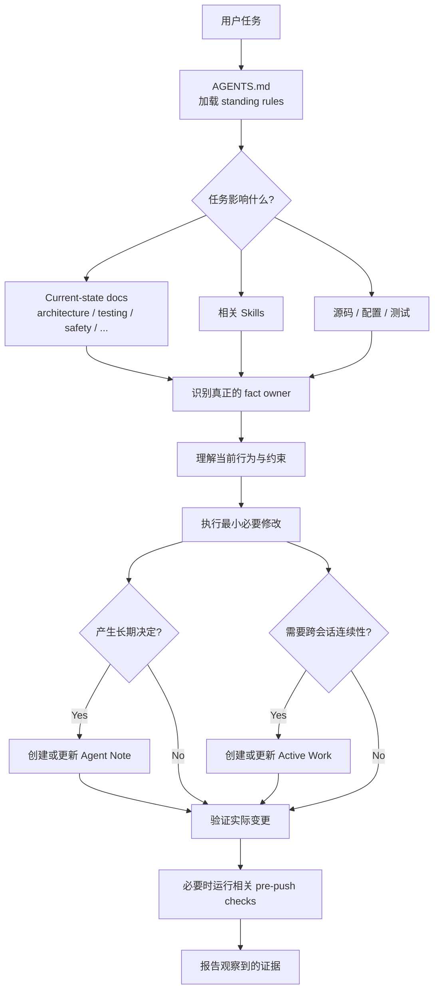
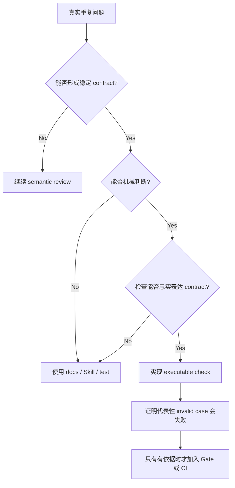

[English](README.md)

# Agent Trellis

> 一个从 DeepSeek Harness 背后的工程实践中提炼出来、以证据驱动的最小 Coding Agent 开发系统。

Agent Trellis 是面向 Coding Agent 开发的仓库内治理模型，当前初始化器仅面向 Codex。它解决的不是“如何让 Agent 写更多代码”，而是一个更基础的问题：

> 当项目跨越更多文件、组件、仓库和会话后，怎样让 Agent 持续知道什么是真的、为什么这样设计、当前做到哪里、需要什么证据，而不是每次重新推导？

Agent Trellis 从 DeepSeek Harness 背后的开发方式中提炼出一套与具体产品解耦的最小结构，并刻意不预装完整 CI、Gate、实验基础设施、文档预算或每种对象的生命周期。

目标很简单：

> 先建立足够小、足够稳定的 Agent 工作骨架，然后让治理能力从真实开发需求中生长。

## 为什么需要它

一次 Coding Agent 任务通常是：

```text
读代码
→ 理解问题
→ 制定计划
→ 修改代码
→ 测试
→ 结束会话
```

但大量真正重要的信息并不能自然地从代码中恢复：

- 为什么这个接口必须保持当前形式？
- 哪个文档才是某项事实的真正 owner？
- 某个看起来多余的 wrapper 为什么还不能删除？
- 跨会话任务上一次做到哪里？
- 哪项测试真正证明了声称的行为？
- 哪些约定已经验证，哪些只是猜测？
- 某个看似合理的设计为什么被拒绝？
- 上一次审查中发现的问题现在是否仍然存在？

如果这些信息只存在于聊天记录或临时推理里，下一次会话就必须重新构建它们。Agent 还很容易通过在每次发现“缺少”时添加结构，制造表面上的完整性：

```text
缺少 owner       → 再创建一个 owner
缺少 lifecycle   → 再创建一个状态机
发现 defect      → 再创建一个跟踪对象
看到一种概念     → 再创建一个 manifest
缺少自动检查     → 再创建一个 Gate
```

最终，治理系统会变得比项目本身更复杂。

Agent Trellis 建立的是另一种工作方式：

> 重要事实有稳定 owner，长期决定有长期记录，临时任务可以恢复，可复用方法由 Skill 承载，而没有当前职责的机制允许暂时不存在。

## 核心模型

整个系统按职责区分信息：

| 信息 | Owner |
| --- | --- |
| 当前已经实现的行为 | 源码、配置和 current-state 文档 |
| 跨组件架构 | `docs/architecture.md` 和其他明确的当前状态 owner |
| 长期设计决定与理由 | `.agents/notes/` |
| 跨会话临时任务状态 | `.agents/work/` |
| Agent 如何完成某类重复工作 | `.agents/skills/` |
| Standing rules 与路由 | `AGENTS.md` |

最重要的规则是：

> **One fact, one owner.**

其他文件可以链接这个 owner，但不应维护可能漂移的可写副本。

## 系统如何运行



这里没有特殊的 Agent Memory Database。持久上下文来自：

```text
源码
+ current-state docs
+ Agent Notes
+ Active Work
+ Skills
```

Agent 每次重新进入项目时，都通过这些由仓库拥有的来源重新建立上下文。

## 生成的工作区

一个典型的初始化仓库从下面的结构开始：

```text
.
├── AGENTS.md
├── docs/
│   ├── AGENTS.md
│   ├── architecture.md
│   ├── development.md
│   └── testing.md
└── .agents/
    ├── notes/
    │   ├── README.md
    │   └── implemented/
    ├── work/
    │   └── README.md
    └── skills/
        ├── project-code-review/
        ├── project-doc/
        ├── project-find-simplifications/
        ├── project-pre-push-checks/
        ├── project-prose-standard/
        └── project-trim-cot-leakage/
```

这些文件不是为了最大化文档覆盖率而存在。每类文件承担不同的记忆职责。

### `AGENTS.md`：路由表

根 `AGENTS.md` 应保持简短。它拥有：

- 仓库和工作区边界；
- 最重要的 standing rules；
- 指向事实 owner 的路由；
- 必须读取特定 owner 的条件；以及
- 少量跨任务始终成立的项目级约束。

它不应该复制 architecture、收集所有测试命令、保存任务进度、列举每种例外或变成 Agent 百科全书。

可以把它理解成项目的路由表，而不是知识库。

### Current-state docs：现在存在什么

`architecture.md`、`development.md`、`testing.md` 和有证据支持的子系统契约回答：

> 当前 checkout 现在是怎样工作的？

其中的声明应来自源码、配置、接口和观察到的命令。一个关键规则是：

> **Unknown remains unknown.**

如果启动路径、数据约定、部署行为或运行关系尚未验证，不要把“应该如此”写成当前事实。

### Agent Notes：为什么形成这个设计

Agent Note 不是任务计划。它保存未来维护者可能仍然需要，但无法从最终实现中可靠恢复的信息：

- 问题；
- 决策或方案；
- 考虑过的替代方案；
- 后果和风险；以及
- 为什么没有采用某个显而易见的替代方案。

源码回答“现在存在什么？”，Agent Note 回答“为什么最终变成这样？”

#### Plan Mode 与 Agent Note 不同

Plan Mode 描述本次任务可能怎样执行。Agent Note 记录任务完成后仍有价值的长期决定。

```text
计划
→ 实现
→ 验证
→ 识别是否产生长期决定
→ 只在需要时创建或更新 Agent Note
```

纯机械修改通常不需要 Agent Note。

### Active Work：跨会话临时记忆

有些任务会跨越多个会话，或者需要明确交接。Active Work 可以保存：

- 当前目标；
- 已验证进度；
- 阻塞项和未知项；
- 下一项安全动作；
- 证据指针；以及
- 长期结果最终应进入的 owner。

Active Work 是临时的。任务完成时：

```text
当前事实       → current-state owner
长期理由       → Agent Note
长期证据       → 已建立的 evidence owner（如果存在）
临时 Work Item → 按契约归档或移除
```

它不是第二套 issue tracker，也不是永久项目历史。

### Skills：可复用工作方法

`AGENTS.md` 保存 standing rules。Skill 保存某类工作的可复用流程和专项判断标准。

生成的核心包含六个通用 Skills：

#### `project-code-review`

使用局部架构、契约、测试和安全边界审查 pull request、提交、分支或工作树 diff。它优先查找有证据支持的缺陷和回归，而不是生成通用 checklist。

#### `project-doc`

判断文档 placement、事实归属、当前状态依据和相关验证。它回答：“这项事实应该放在哪里，什么证据证明它是真的？”

#### `project-prose-standard`

在仓库文本中保持 actor、condition、timing、obligation、failure mode、exception 和 consequence。目标不只是减少字数，而是在不削弱契约的前提下减少重复。

#### `project-trim-cot-leakage`

清理审查对话、计划引用、编辑时间线和“现在应该可以工作”等创作过程残留，同时保留长期理由和约束。

#### `project-find-simplifications`

寻找重复状态、透传层、推测性抽象、未使用兼容路径、镜像表示和手写基础设施。真正的简化会减少 owned complexity，而不是把复杂度移到别处。

#### `project-pre-push-checks`

选择覆盖实际待发送 diff 的最小安全本地检查。`testing.md` 拥有什么证据能够证明什么；这个 Skill 决定当前需要哪些已有证据。

只有重复需求出现后，才应添加项目专项 Skills。某个服务可能最终需要 `database-migration-review`、`security-boundary-review` 或 `deployment-review`；其他项目会需要不同扩展。Skill 数量不是完整性指标。

## 安装与初始化

让 Codex 使用 `$skill-installer`，从 `le876/agent-trellis` 安装 [`skills/agent-trellis-init`](skills/agent-trellis-init/SKILL.zh-CN.md)。安装后新建一个任务，进入目标仓库并调用 `$agent-trellis-init`。

版本 1 仅面向 Codex，并且有意不提供 CLI。

初始化器强制执行确认边界：

1. 只读审计仓库，不写入文件。
2. 从源码、配置、文档和安全的可观察命令中提取事实。
3. 冲突或无法验证的声明保持未知。
4. 展示 owner map，以及每个需要创建、合并或保留的文件。
5. 等待用户明确确认。
6. 生成最小且有用的治理层，并完成验证。

它不会覆盖已有规则，不会提交、推送、访问生产系统或执行其他会改变外部状态的操作。再次运行时，它会审计漂移并提出合并建议；它不是上游同步器，也不会删除项目定制。

生成语言跟随目标仓库已经建立的文档语言；语言不明确时初始化器会询问。只有仓库证据确有需要时，才生成安全、信息安全、数据契约、部署或其他专项 owner。

## 日常使用

大多数情况下，用户不需要在每次 prompt 中重述治理流程，只需描述真正的任务。

### 实现修改

> 为这个组件增加 timeout 处理。检查受影响的 producer、consumer、文档和测试，并保留已有修改。

Agent 应自行通过适用规则、owner、Skills、实现和验证进行路由。

### 只规划，不实现

> 分析这个接口应该怎样修改并给出实现计划，不要修改文件。

Plan 不会自动成为 Agent Note。设计被接受或实现时，才可能需要记录长期决定。

### 审查代码

> 审查当前 diff，重点检查跨组件接口、生命周期行为和 failure semantics。

这类任务应使用 `project-code-review`。

### 寻找简化

> 检查这个模块是否存在可以移除的 wrapper、重复状态或推测性抽象，只保留有证据支持的候选项。

这类任务应使用 `project-find-simplifications`。

### 更新文档

> 根据当前源码更新 architecture，只描述当前行为并清理编辑历史。

这类任务应使用 `project-doc`，并在有帮助时使用行文和推理泄露清理 Skills。

### 准备推送

> 针对当前 diff 运行 pre-push checks，只选择覆盖实际变更的检查。

这类任务应使用 `project-pre-push-checks`。

### 保存跨会话工作

> 这个任务会跨越多个阶段。创建 Active Work，记录已验证进度和下一项安全动作。

只有这种连续性需求才应创建 Work Item。

## 将系统适配到项目

不要从复制成熟 Harness 的所有机制开始。

### Phase 1：定义工作区

创建根 `AGENTS.md`。建立仓库边界、初始事实 owner、必要的 standing rules 和 Agent 起点。避免罗列所有可能的例外。

### Phase 2：建立最少的当前状态 owner

只从项目能够用证据支持的 owner 开始，通常包括：

```text
architecture.md
development.md
testing.md
```

数据密集型服务可能还需要 `data-model.md`，已部署服务可能需要 `security.md` 或 `deployment.md`。不要为了让目录看起来完整而创建空文档。

### Phase 3：引入 Agent Notes

当项目开始提出“为什么选择 A 而不是 B？”、“为什么必须保留这个接口？”或“为什么拒绝这个方案？”时，使用长期决策记录。

### Phase 4：选择核心 Skills

从高频工作开始。代码审查、文档和推送前选择通常可以优先引入。当观察到的失败模式证明有需要时，再加入行文、推理泄露清理和简化 Skills。

### Phase 5：回到产品开发

停止扩展治理，开始实现真实 feature、fix、refactor、experiment 或 integration。实践会揭示下一层有用治理。

## 治理系统如何生长

治理能力应由观察到的失败模式推动，而不是由想象中的完整性推动。



正确顺序是：

```text
真实问题
→ 稳定 contract
→ 可靠的 mechanical invariant
→ verifier
→ 必要时加入 Gate 或 CI
```

而不是“成熟项目应该有这个机制，所以创建它”。

### 什么不应该太早添加

Agent Trellis 不要求每个初始化项目一开始就拥有：

- 完整 CI matrix；
- Hooks 和 documentation Gates；
- 数字化文档预算；
- 双语配对；
- 实验 evidence database；
- Skill lifecycle system；
- 所有能够想象的 domain Skill；或者
- 每类对象的 archive 与 status 状态机。

只有项目形成对应职责或重复问题时，这些机制才可能变得有价值。

当 Agent 发现某个东西“缺少”时，应先问：

> **What current responsibility requires this object, and why are deletion, deferral, or an existing owner insufficient?**

合法答案可以是删除重复信息、链接已有 owner、保留 unknown、延期工作或执行 focused verification。Absence is not automatically a defect。

## 与 DeepSeek Harness 的关系

Agent Trellis 不是 DeepSeek Harness 的复制品。它抽取了一小组通用开发思想：

| Harness 思想 | Agent Trellis 中的抽象 |
| --- | --- |
| Root agent rules | `AGENTS.md` |
| Documentation ownership | `docs/AGENTS.md` |
| Durable design decisions | Agent Notes |
| Temporary cross-session context | Active Work |
| Code-review workflow | `project-code-review` |
| Documentation workflow | `project-doc` |
| Simplification workflow | `project-find-simplifications` |
| Pre-push selection | `project-pre-push-checks` |
| Prose standard | `project-prose-standard` |
| Reasoning-leakage cleanup | `project-trim-cot-leakage` |

不会仅因为上游存在就复制产品专用基础设施。第三方来源和固定适配基线由 [`THIRD_PARTY_NOTICES.zh-CN.md`](THIRD_PARTY_NOTICES.zh-CN.md) 拥有；初始化器的实际行为由本地 Skill 拥有。

## 什么时候算初始化完成

当 Agent 能够稳定回答下面的问题时，初始化就已经完成：

1. 这项事实属于哪里？
2. 当前实现到底是什么？
3. 这个长期决定为什么存在？
4. 跨会话交接后的下一项动作是什么？
5. 这次变更需要什么证据？
6. 哪些内容可以移除，哪些是 load-bearing contract？

做到这些后，就应该停止建设 Agent System，回到产品工作。让实际失败揭示下一项治理需求。

## 设计原则

- **One fact, one owner.** 不要维护多个可写副本。
- **Current state is current state.** 历史、审查对话和会话推理不属于 current-state docs。
- **Evidence over self-report.** Agent 说“成功”不是外部证据。
- **Durable decisions deserve durable memory.** 保存会影响未来维护的决定。
- **Temporary work should expire.** 跨会话状态有用，但不应永久积累。
- **Prefer net simplification.** 移动复杂度不等于删除复杂度。
- **Unknown is a valid state.** 不要用假设填补证据空白。
- **Absence is not automatically a gap.** 不要为没有当前职责的机制创建结构。
- **Grow from practice.** 真实开发问题决定下一层治理。

## 分发仓库

- [`skills/agent-trellis-init/`](skills/agent-trellis-init/SKILL.zh-CN.md) 包含可安装的 Codex Skill。
- [`i18n/pairs.json`](i18n/pairs.json) 声明分发文档的英文与中文配对。英文是 canonical 版本，中文是同步译本。
- [`scripts/validate.py`](scripts/validate.py) 使用标准库检查双语结构、链接、占位符、Skill metadata、模板和 fixtures。
- [`tests/scenarios.zh-CN.md`](tests/scenarios.zh-CN.md) 定义初始化验收场景。

使用以下命令验证分发仓库：

```sh
python3 scripts/validate.py
```

Agent Trellis 使用 MIT 许可证。来源和固定 DeepSeek Harness 许可证声明见 [`THIRD_PARTY_NOTICES.zh-CN.md`](THIRD_PARTY_NOTICES.zh-CN.md)。
